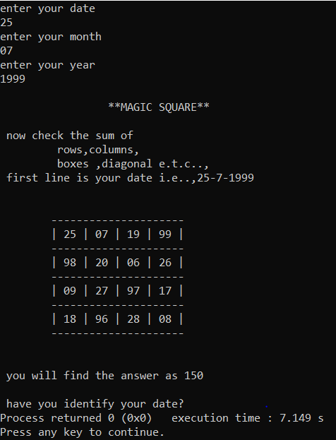

# MAGIC SQUARE IN C
## WHAT WE WILL GET:-
You can get the Magic Square of any date or your birthday with beautiful UI
## HOW IT WORKS AND WHAT ITS SPECALITY
This code was inspired by Ramanujans-magic-square , here is the blog [how-it-works](https://www.quora.com/What-is-Srinivasa-Ramanujans-magic-square)
## HERE IS THE EXAMPLE:-

